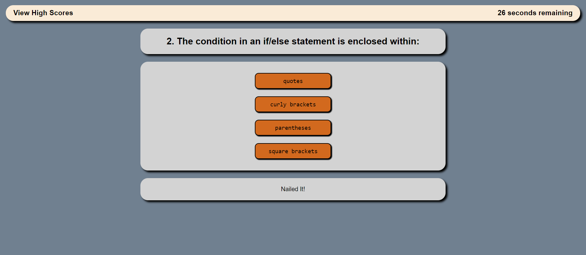

# JavaScript Quiz - John Zigterman

## Description

- I attempted to create a rudimentary, button based JavaScript quiz.
- A set of arrays may contain any number of questions with four answers each to be presented as buttons.
- When the correct answer is clicked, the user's score increments.
- When the incorrect answer is clicked, the user loses time to complete the quiz.
- The user is presented with their score when the quiz is complete, and they may log it to the high score board.

## Installation

This is a web application that can be used with any web browser.

## Usage

This application can be used to assess if the user has rudimentary JavaScript knowledge and help them improve on that knowledge.

## Credits

I, John Paul Zigterman, completed this project by myself with the aid of the resources provided to me by the MSU coding bootcamp.

## Link

https://johnpaulzigterman.github.io/codequiz/

## Screenshot

## License

MIT License

Copyright (c) 2023 John Paul Zigterman

Permission is hereby granted, free of charge, to any person obtaining a copy
of this software and associated documentation files (the "Software"), to deal
in the Software without restriction, including without limitation the rights
to use, copy, modify, merge, publish, distribute, sublicense, and/or sell
copies of the Software, and to permit persons to whom the Software is
furnished to do so, subject to the following conditions:

The above copyright notice and this permission notice shall be included in all
copies or substantial portions of the Software.

THE SOFTWARE IS PROVIDED "AS IS", WITHOUT WARRANTY OF ANY KIND, EXPRESS OR
IMPLIED, INCLUDING BUT NOT LIMITED TO THE WARRANTIES OF MERCHANTABILITY,
FITNESS FOR A PARTICULAR PURPOSE AND NONINFRINGEMENT. IN NO EVENT SHALL THE
AUTHORS OR COPYRIGHT HOLDERS BE LIABLE FOR ANY CLAIM, DAMAGES OR OTHER
LIABILITY, WHETHER IN AN ACTION OF CONTRACT, TORT OR OTHERWISE, ARISING FROM,
OUT OF OR IN CONNECTION WITH THE SOFTWARE OR THE USE OR OTHER DEALINGS IN THE
SOFTWARE.